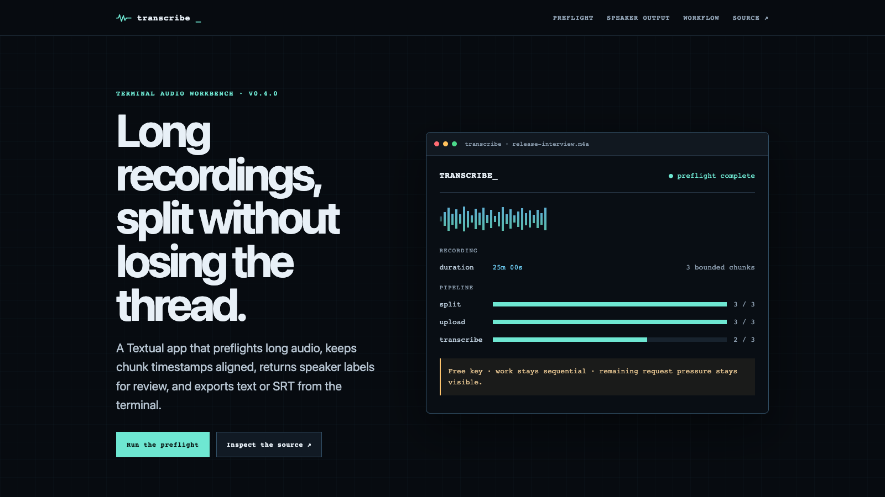
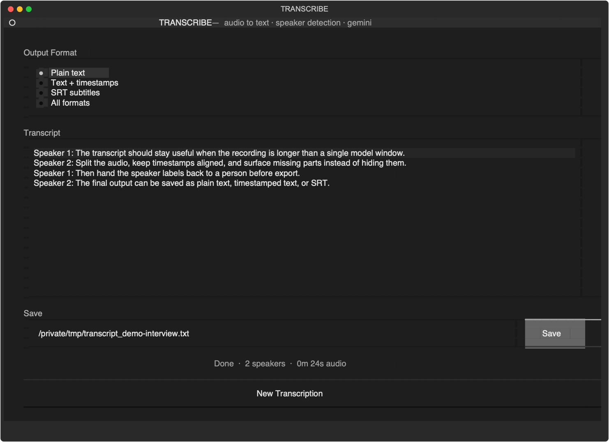

<p align="center">
  
</p>

# Transcribe

A Textual terminal app for speaker-aware audio transcription with visible long-audio handling, a process-local free-key guard, and text or SRT export.

[Try the deterministic demo](https://wachtermar.github.io/transcribe/) · [Watch the nine-second walkthrough](https://wachtermar.github.io/transcribe/assets/transcribe-demo.mp4) · [Inspect the workflow](#how-it-works) · [Run locally](#quick-start)

## What it proves

- A terminal interface with buttons, inputs, progress bars, settings, and keyboard navigation.
- Long recordings are split at ten-minute boundaries before provider work.
- Free-key mode runs chunks sequentially and applies a conservative process-local request guard before provider work; paid-key mode allows up to five concurrent transcription workers.
- Detected speaker labels can be previewed and renamed before export.
- Output can be saved as plain text, timestamped text, SRT, or all formats.
- Partial chunk failures remain separate from the merged transcript.

The [browser demo](https://wachtermar.github.io/transcribe/) is intentionally bounded: it mirrors deterministic preflight and output-formatting behavior with sanitized data. It does not upload audio, request an API key, or call Gemini.

## Interface

<p align="center">
  
</p>

The screenshot is rendered from the current public Textual source with a sanitized 24-second demo transcript. It demonstrates interface behavior, not model accuracy or customer use.

## Quick start

Requirements: Python 3.10+, [uv](https://docs.astral.sh/uv/), `ffmpeg`, and `ffprobe`.

```bash
git clone https://github.com/wachtermar/transcribe.git
cd transcribe
uv run transcribe.py
```

Or run the public script directly:

```bash
uv run https://raw.githubusercontent.com/wachtermar/transcribe/main/transcribe.py
```

Common commands:

```bash
uv run transcribe.py recording.mp3  # pre-load a file
GEMINI_API_KEY=YOUR_KEY uv run transcribe.py  # preferred one-process override
uv run transcribe.py --reset-key     # remove the saved key
```

API keys resolve from the `-k` flag, `GEMINI_API_KEY` or `GOOGLE_API_KEY`, saved platform storage, then the first-run settings dialog. Saved keys use macOS Keychain, Windows AppData, or a permission-restricted Linux config file. Prefer an environment variable or saved platform storage: command-line `-k` values can be exposed through shell history or process listings.

## How it works

```text
local audio
    │
    ▼
duration + process-local request guard
    │
    ├── hold before provider work when the local free-key budget is insufficient
    │
    ▼
≤10-minute chunks → upload readiness → transcription
                                      │
                                      ├── free key: sequential
                                      └── paid key: ≤5 concurrent workers
    │
    ▼
timestamp merge → speaker preview + rename → text / timestamps / SRT
```

The app exposes split, upload, and transcription as separate progress phases. When a part fails, the error is retained separately and only successful results are merged.

## Keyboard shortcuts

| Key | Action |
| --- | --- |
| `Ctrl+K` | Open key and tier settings |
| `Ctrl+Q` | Quit |
| `Tab` | Move between controls |

## Verification

```bash
uv run python -m py_compile transcribe.py
uv run python -m unittest discover -s tests -v
uvx ruff check transcribe.py tests
```

The tests cover deterministic chunk preflight, timestamp offsets, speaker ordering, and SRT conversion. They do not call Gemini.

## Boundaries

- Transcription requires a user-supplied Gemini API key and sends selected audio to that provider.
- The 20-call free-key guard counts successful calls in the current process only. It is not a provider quota reading and cannot see project activity from other sessions.
- Rate limits and model quality are provider behavior; this repository does not promise availability, accuracy, or a fixed quota.
- The app is an inspectable public utility, not evidence of customer deployments or production scale.

## License

MIT
